```{r setup, include=FALSE,echo=FALSE}
knitr::opts_chunk$set(echo = FALSE)
library(knitr)
library(tidyverse)
library(RSocrata)
library(dygraphs)
library(xts)
library(incidence)
library(aTSA)
library(lmtest)
library(forecast)
library(dplyr)
library(seastests)
library(trend)
library(xtable)
library(graphics)
library(textreadr)
library(sf) #Contiene funciones para codificar datos espaciales.
library(ggplot2) #Sirve para crear graficos y mapear
library(tmap) #Importa mapas tematicos en los cuales se visualizan las distribuciones de datos espaciales.
library(tmaptools) #Conjunto de herramientas para leer y procesar datos espaciales.
library(leaflet) #Crea y personaliza mapas interactivos usando una biblioteca de JavaScript
library(rgdal) #Proporciona enlaces a la Biblioteca de abstraccion de datos 'geoespaciales' y acceso
#a las operaciones de proyeccion. 
library(sp) #Clases y metodos para datos espaciales.
library(readxl) #Importa archivos de excel a R.
library(mapview)
library(dygraphs)
library(xts)          # To make the convertion data-frame / xts format
library(lubridate)
```

```{r descarga_datos, echo=FALSE, message=FALSE}
df.ins=read.csv("/Users/Natalia/Desktop/TESIS/2020-2/DOCUMENTOS FINAL TESIS/21dic.csv")
df.ins$fecha_inicio_sintomas <- as.Date(df.ins$fecha_inicio_sintomas,tryFormats = c("%d-%m-%Y", "%d/%m/%Y"))
df.ins$fecha_de_notificaci_n <- as.Date(df.ins$fecha_de_notificaci_n, tryFormats = c("%d-%m-%Y", "%d/%m/%Y"))
df.ins$fecha_muerte <- as.Date(df.ins$fecha_muerte, tryFormats = c("%d-%m-%Y", "%d/%m/%Y"))
df.ins$fecha_recuperado <- as.Date(df.ins$fecha_recuperado, tryFormats = c("%d-%m-%Y", "%d/%m/%Y"))
df.ins$fecha_reporte_web <- as.Date(df.ins$fecha_reporte_web, tryFormats = c("%d-%m-%Y", "%d/%m/%Y"))
df.ins$fecha_diagnostico  <- as.Date(df.ins$fecha_diagnostico, tryFormats = c("%d-%m-%Y", "%d/%m/%Y"))
#De la 11 a la 16 convierte en formato fecha corta.

df.ins$confirmados <- "Confirmados" #Crea una columna para tener un conteo de los confirmados diarios.

df.ins <- df.ins %>%
  dplyr::select(id_de_caso,
                ciudad_municipio_nom,
                fecha_inicio_sintomas,
                confirmados,
                fecha_de_notificaci_n,
                fecha_diagnostico,
                fecha_muerte,
                fecha_reporte_web,
                everything()) #Reorganiza la base.
inc.casos.colombia.confirmados <- incidence(df.ins$fecha_reporte_web,
  groups = df.ins$confirmados) #Hace un conteo de cantidad de 
#confirmados por fecha.
serie.colombia <- xts(x = inc.casos.colombia.confirmados$counts,
                      order.by = inc.casos.colombia.confirmados$dates) #Crea una serie de tiempo con la 
#cantidad de confirmados.
ts_colombia<- ts(serie.colombia) #Convierte en una serie de tiempo tipo ts la serie anterior.
```

<center>
<h1>Estimación de la curva y pronóstico del número de infectados por COVID-19 mediante modelos estadísticos en Colombia durante el año 2020</h1>
<h3>Autora: Natalia Vanegas Torres</h3>
<h4>Fecha: 01/02/2021</h4>
</center>
```{r puj, fig.align="center",out.width="250px"}

```

##
<center>
<h3>Introducción</h3>
</center>

En este trabajo se muestra la importancia de los modelos estadísticos en la elaboración de pronósticos a corto plazo en enfermedades contagiosas como el COVID-19 en Colombia durante el año 2020.

En primer lugar, se descargaron los datos suministrados por el INS desde el portal datos abiertos Colombia, se realizó una serie de tiempo con la cantidad de confirmados diarios hasta el día 21 de diciembre de 2020 para pronosticar la cantidad de contagios que se presentarían entre el 22 de diciembre y el 31 de diciembre de 2020.

Se utilizaron los modelos Holt, Holt-Winters, Medias Móviles y ARIMA para realizar este pronóstico, posteriormente se realizó la validación con los errores de Desviación Absoluta de la Media, Error Cuadrático Medio y Raíz del Error Cuadrático Medio con el fin de determinar el mejor modelo para pronosticar la curva de contagios.

<center>
```{r covid, fig.align="center",out.width="400px"}
include_graphics("covid.jpg")
```
</center>


##
<center>
<h3>Objetivo General</h3>
</center>
<div style="text-align: justify">
Estimar y pronosticar por medio de métodos estadísticos la curva de propagación del COVID-19 durante el año 2020 en Colombia eligiendo el mejor método que permita pronosticar el número de contagios diarios en Colombia con el fin de brindar una herramienta informativa a los colombianos.
</div>

<center>
<h3>Objetivos Específicos</h3>
</center>
<div style="text-align: justify">
* Realizar una revisión de las principales metodologías para una generación de pronósticos con el fin de ser utilizados en la construcción de modelos de la serie de tiempo generada por la transmisión del virus COVID-19.
* Construir e identificar diferentes modelos de pronóstico con los datos obtenidos a nivel nacional para analizar el comportamiento del COVID-19 en Colombia.
* Realizar un análisis comparativo de los modelos de pronóstico seleccionados para escoger el que mejor se ajuste a la serie a partir de indicadores estadísticos y representarlos gráficamente.
* Generar una estrategia de comunicación que permita a los ciudadanos visualizar la cantidad de contagiados, muertos y recuperados por COVID-19 en los departamentos de Colombia durante el año 2020.
</div>

##
<center>
<h3>¿Qué es un pronóstico?</h3>
</center>
<div style="text-align: justify">
"Un pronóstico es el proceso de estimación de un acontecimiento futuro proyectando hacia el futuro datos del pasado." 

Everett y Ebert. 
</div>
<center>
<h3>Selección de método de pronóstico</h3>
</center>
<div style="text-align: justify">
Para seleccionar un método de pronóstico adecuado es necesario tener en cuenta aspectos como:

* El pronóstico necesita detalles específicos o si el estado futuro requiere algún factor global.
* Pronóstico a corto o largo plazo.
* Escoger un método que facilite la toma de decisiones.
</div>


##
<center>
<h3>Pasos para seleccionar un pronóstico</h3>
```{r pasos_pronosticos, fig.align="bottom",out.width="1100px"}
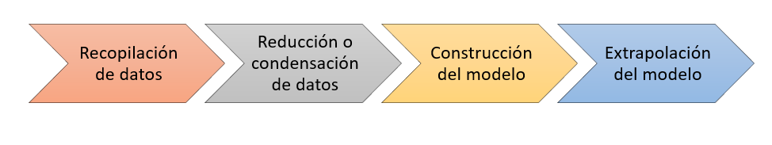
```
</center>

##
<center>
<h3>Medición de error de pronóstico</h3>
</center>


<center>
$e_t = Y_t - \widehat{Y_t}$
</center>

Donde:

* $e_t:$ Error del pronóstico en el periodo $t$.
* $Y_t:$ Valor real en el periodo $t$.
* $\widehat Y_t:$ Valor del pronóstico en el periodo $t$.

En este estudio tendrémos los siguientes errores:

<center>
<h4>Desviación absoluta de la media (DAM)</h4>
</center>
<div style="text-align: justify">
Mide la precisión de un pronóstico a través de la magnitud de los errores de pronóstico, es decir mediante valores absolutos. Es utilizado cuando se desea medir el error de pronóstico en las mismas unidades de la serie original.
</div>
<center>
$DAM=\dfrac{1}{n}\displaystyle{\sum_{t=1}^n}|Y_t-\widehat{Y_t}|$
</center>

##
<center>
<h4>Error cuadrático medio (EMC)</h4>
</center>
<div style="text-align: justify">
Este método penaliza los errores mauores de pronóstico puesto que eleva cada error al cuadrado, lo que es útil cuando se requiere una técnica que produzca errores moderados en lugar de errores pequños.
</div>
<center>
$EMC=\dfrac{1}{n} \left(\displaystyle{\sum_{t=1}^{n}}(Y_t - \widehat{Y_t})\right)^2$
</center>


<center>
<h4>Raíz del error cuadrático medio (RMSE)</h4>
</center>
<div style="text-align: justify">
Este método representa la raíz cuadrada de las diferencias entre los valores previstos y los valores observados. La RMSE es sensible a los valores atípicos dado que los errores mayores tienen un efecto muy grande.
</div>
<center>
$RMSE=\sqrt{\dfrac{1}{n}\left(\displaystyle{\sum_{t=1}^{n}}(Y_t - \widehat{Y_t})\right)^2}$
</center>


##
<center>
<h3>Métodos de pronósticos</h3>
</center>
<center>
```{r cuadro, fig.align="center",out.width="750px"}
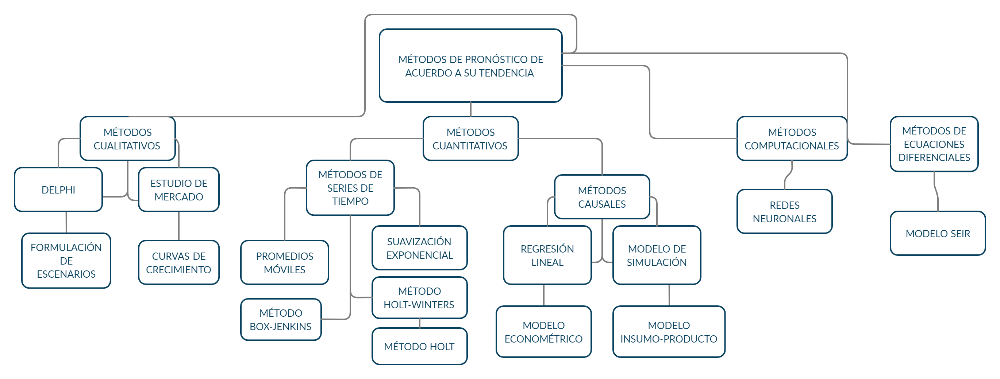
```
</center>


##
<center>
<h4>Métodos de series de tiempo</h4>
</center>
<div style="text-align: justify">
Son utilizados para realizar análisis detallados de los patrones históricos de una variable a lo largo del tiempo y proyectarlos hacia el futuro.

* **Tendencia (T):** Es el componente de largo plazo que representa el crecimiento o decrecimiento en la serie sobre un periodo amplio.
* **Componente cíclico (C):** Es la fluctuación en forma de onda alrededor de la tendencia.
* **Componente estacional (S):** Es un patrón de cambio que se repite a si mismo año tras año.
* **Componente aleatorio (A):** Mide la variabilidad de las series de tiempo después de retirar los demás componentes.
</div>

\

<center>
```{r componentes, fig.align="center",out.width="1200px"}
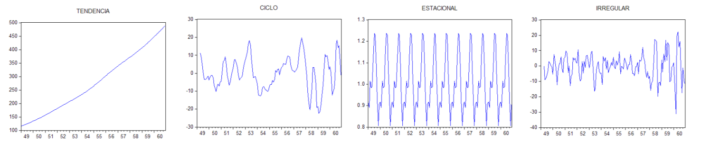
```
</center>


##
<center>
<h4>Método de medias móviles</h4>
</center>
<div style="text-align: justify">
El objetivo de este método es usar los datos anteriores para así desarrollar un modelo de pronóstico futuro, para realizar el pronóstico se halla el promedio a cada par de número consecutivos para de esta forma crear una nueva serie de tiempo y tratar de predecir los valores siguientes.
</div>

<h4>Método de medias móviles</h4>
<center>
$M_t=\widehat{Y}_{t+1}=\dfrac{1}{n}(Y_{t}+Y_{t-1}+Y_{t-2}+...+Y_{t-n+1})$
</center>

Donde:

* $M_t:$ Promedio móvil en el periodo $t$.
* $\widehat{Y}_{t+1}:$ Valor de pronóstico para el siguiente periodo.
* $Y_{t}:$ Valor real en el periodo $t$.
* $n:$ Número de términos en el promedio móvil.

##
<center>
<h4>Método de medias móviles</h4>
</center>
<div style="text-align: justify">
Se debe tener en cuenta lo siguiente:

* El promedio móvil para el periodo $t$ es la media aritmética de las $n$ observaciones más recientes.
* Se asignas ponderaciones iguales a cada observación.
* Cada nuevo punto de datos se incluye en el promedio y se descarta el más antiguo.
* El modelo de promedio móvil funciona mejor con datos estacionarios puesto que no maneja muy bien la tendencia o estacionalidad.
</div>

##
<center>
<h4>Método de suavización exponencial</h4>
</center>
<div style="text-align: justify">
Es un método utilizado para revisar constantemente una estimación basado en experiencias recientes. 
</div>

Este método está dado por:
<center>
$\widehat{Y}_{t+1}=\alpha Y_{t} + (1-\alpha)\widehat{Y}_t$
</center>
Donde:

* $\widehat{Y}_{t+1}:$ Valor de pronóstico para el siguiente periodo.
* $\alpha:$ Constante de suavización con $0<\alpha <1$.
* $Y_{t}:$ Nueva observación de la serie en el periodo $t$.
* $\widehat{Y}_{t}:$ Valor suavizado de la serie atenuada al periodo $t-1$.

##
<center>
<h4>Método de descomposición</h4>
</center>
<div style="text-align: justify">
Se usan para pronosticar cuando hay estacionalidad en la serie de tiempo o cuando se quiere estudiar la naturaleza de los componentes.
</div>


<center>
<h4>Método de descomposición aditivo</h4>
</center>
<center>
$X_{t}=T_{t}+S_{t}+A_{t}$
</center>


<center>
<h4>Método de descomposición multiplicativo</h4>
</center>
<center>
$X_{t}=(T_{t})(S_{t})(A_{t})$
</center>

Donde:

* $X_{t}:$ Variable a estimar.
* $T_{t}:$ Modela el comportamiento de la serie a largo plazo.
* $S_{t}:$ Modela el comportamiento periódico de la serie.
* $A_{t}:$ Representa la parte impredecible de la serie.

##
<center>
<h4>Método de Holt</h4>
</center>
<div style="text-align: justify">
Este modelo añade al modelo de suavizamieto exponencial un componente debido a la tendencia. Se presentan dos parámetros importantes como lo son:

* $\alpha:$ Constante de suavizamiento.
* $\beta:$ Constante de tendencia.
</div>

El modelo Holt está dado por:

<center>
$\widehat{Y}_{t}=L_{t}+pT_{t}$
</center>
Donde:

* $\widehat{Y}_{t}:$ Valor pronosticado para el periodo $t$.
* $L_{t}:$ Valor estimado para el periodo $t$.
* $T_{t}:$ Valor de la tendencia para el periodo $t$.
* $p:$ Periodos futuros a pronosticar.

##
<center>
<h4>Método de Holt</h4>
</center>
El valor estimado para la variable predictora está dado por:

<center>
$L_{t}=\alpha Y_{t-1}+(1-\alpha)(L_{t-1}+T_{t-1})$
</center>

El valor estimado para la tendencia está dado por:

<center>
$T_{t}=\beta(L_{t}-L_{t-1})+(1-\beta)T_{t-1}$
</center>

##
<center>
<h4>Método de Holt-Winters</h4>
</center>
<div style="text-align: justify">
Es un método iterativo que realiza un pronóstico sobre el comportamiento de una serie en cada tiempo. Es una versión extendida del método de Holt, dado que el método de Holt-Winters además de los parámetros para nivel $(\alpha)$ y tendencia $(\beta)$ agrega un parámetro para la estacionalidad $(\gamma)$.
</div>


El método de Holt-Winters utiliza la siguiente estructura:


<center>
**Estimación del nivel**

$N_{t}=\alpha+(1-\alpha)(N_{t-1}+T_{t-1})$
</center>
Donde:

* $N_{t}:$ Valor suavizado del nivel del periodo $t$.
* $\alpha:$ Constante de suavizamieto del nivel.
* $N_{t-1}:$ Valor suavizado del nivel del periodo $t-1$.
* $T_{t-1}:$ Estimación de la tendencia en el periodo $t-1$.

##
<center>
**Estimación de la tendencia**

$T_{t}=\beta(N_{t}-N_{t-1})+(1-\beta)T_{t-1}$
</center>
Donde:

* $T_{t}:$ Estimación de la tendencia en el periodo $t$.
* $\beta:$ Constante de suavizamiento de la tendencia.
* $N_{t}:$ Valores suavizados del nivel del periodo $t$.
* $N_{t-1}:$ Valores suavizados del nivel del periodo $t-1$.
* $T_{t-1}:$ Estimación de la tendencia en el periodo $t-1$.

##
<center>
**Estimación de la estacionalidad**

$E_{t}=\gamma + (1-\gamma)E_{t-s}$
</center>
Donde:

* $E_{t}:$ Estimación de la estacionalidad en el periodo $t$.
* $\gamma:$ Constante de suavizamiento de la estacionalidad.
* $s:$ Subíndice que representa la longitud de la estacionalidad.
* $E_{t-s}:$ Estimación de la estacionalidad en el periodo $t-s$.

##
<center>
**Pronóstico**

$F_{t+1}=(N_{t}+T_{t})E_{t-s+1}$
</center>
Donde:

* $F_{t+1}:$ Pronóstico del periodo $t$.
* $N_{t}:$ Valor suavizado del nivel del periodo $t$.
* $T_{t}:$ Estimación de la tendencia en el periodo $t$.
* $s:$ Subíndice que representa la longitud de la estacionalidad.
* $E_{t-s+1}:$ Estimación de la estacionalidad en el periodo $t-s+1$.

##
<center>
<h4>Método de Box-Jenkins</h4>
</center>
<div style="text-align: justify">

Este enfoque asume que la serie temporal a predecir es generada por un proceso estocástico, para estimar una serie ARIMA se requiere de un gran número de observaciones. 
</div>

<div style="text-align: justify">

* **Autorregresivo (AR(p)):** Está dado por la siguiente ecuación:

<center>
$Y_{t}=\phi_{1}Y_{t-1}+\phi_{2}Y_{t-2}+...+\phi_{p}Y_{t-p}+a_{t}$, $a_{t}$ 
</center>
* **Integrado (I):**  Diferenciación para eliminar la estacionalidad.

* **Medias Móviles (MA(q)):** Está dado por la siguiente ecuación:

<center>
$Y_{t}=a_{t}-\theta_{1}a_{t-1}-\theta_{2}a_{t-2}-...-\theta_{q}a_{t-q}$, $a_{t}$
</center>

* $Y_t:$ Pronóstico para el tiempo $t$.
* $Y_{t-n}:$ Pronóstico en el tiempo anterior $n$.
* $a_t\sim N(0,\sigma^2)$.
* $\theta_t:$ Parámetros pertenecientes a la parte de medias móviles.
* $\phi_t:$ Parámetros pertenecientes a la parte autorregresiva.
</div>

##

<center>
<h4>Método de Box-Jenkins</h4>
</center>
Finalmente, un modelo ARIMA está dado por la siguiente ecuación:

<center>
$Y_{t}=\phi_{0}+\phi_{1}Y_{t-1}+...+\phi_{p}Y_{t-p}+a_{t}-\theta_{1}a_{t-1}-...-\theta_{q}a_{t-q}-(\Delta^{d}Y_{t}-Y_{t})$
</center>


Donde:

* $Y_t:$ Pronóstico para el tiempo $t$.
* $Y_{t-n}:$ Pronóstico en el tiempo anterior $n$.
* $a_t\sim N(0,\sigma^2)$.
* $\theta_t:$ Parámetros pertenecientes a la parte de medias móviles.
* $\phi_t:$ Parámetros pertenecientes a la parte autorregresiva.
* $d:$ Cantidad de diferenciaciones requeridad para eliminar la tendencia.
* $\Delta Y_t:$ Variación entre cada par de tiempos consecutivos.

##
<center>
<h3>Resultados obtenidos</h3>
<h4>Presentación de variables</h4>
</center>

La información de los casos de COVID-19 en Colombia al día 31 de diciembre es obtenida del Instituto Nacional de Salud (INS).

<center>
```{r variables, fig.align="center",out.width="800px"}
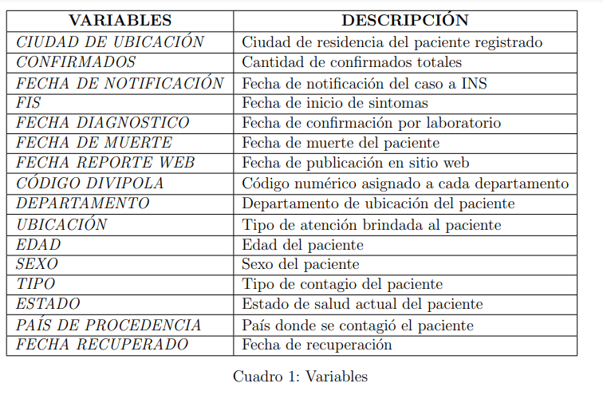
```
</center>

##
<center>
<h4>Análisis Univariado</h4>
</center>

```{r arima_grafica, fig.align="center",out.width="600px"}
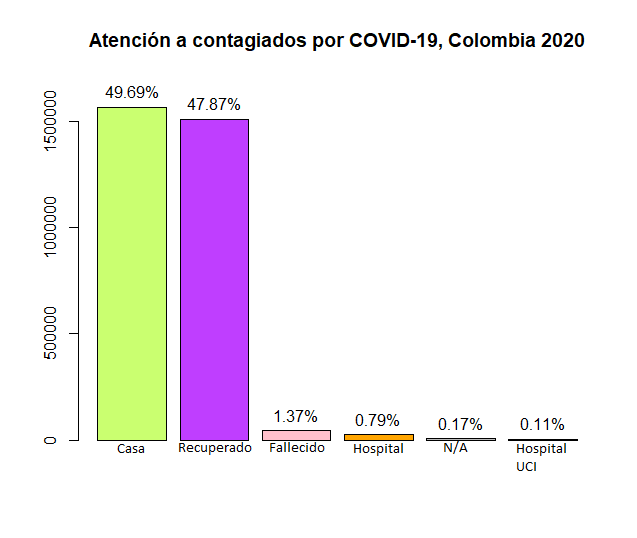
```
</center>

##
<center>
<h4>Análisis Univariado</h4>
</center>


<center>
```{r tipo, fig.align="center",out.width="600px"}
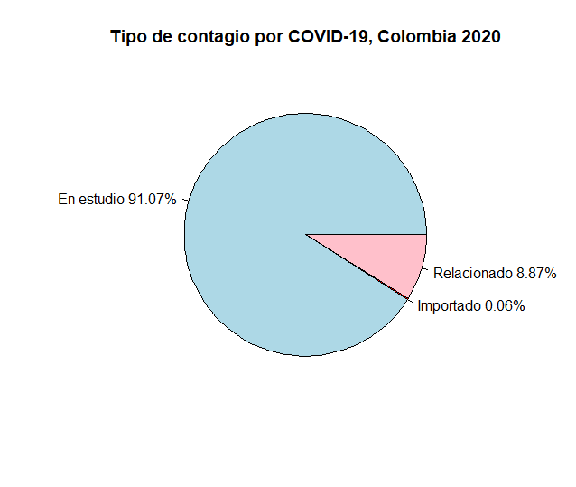
```
</center>

##
<center>
<h4>Análisis Univariado</h4>
</center>

<center>
```{r edad, fig.align="center",out.width="600px"}
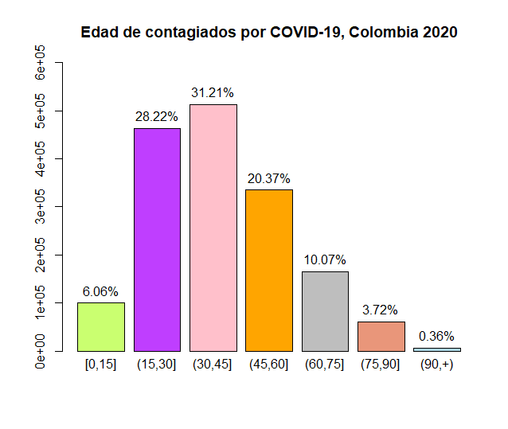
```
</center>


##
<center>
<h4>Análisis Univariado</h4>
<h5>Departamentos</h5>
</center>

<center>
```{r departamentos_contagios, fig.align="center",out.width="600px"}
include_graphics("departamentos_contagios.png")
```
</center>

##
<center>
<h4>Análisis Univariado</h4>
<h5>Departamentos</h5>
```{r departamentos_fallecidos, fig.align="center",out.width="600px"}
include_graphics("departamentos_fallecidos.png")
```
</center>


##
<center>
<h4>Análisis Descriptivo Bivariado</h4>
<h5>Cantidad de muertos por edad</h5>
</center>
<center>
```{r edad_fall, fig.align="center",out.width="600px"}
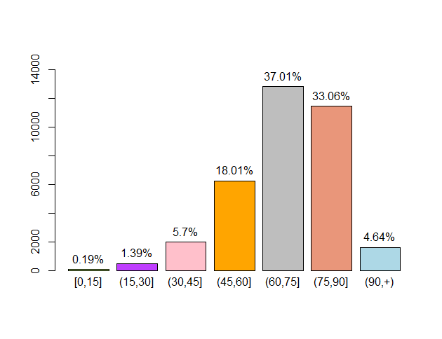
```
</center>

##
<center>
<h4>Análisis Descriptivo Bivariado</h4>
<h5>Cantidad de recuperados por edad</h5>
</center>
<center>
```{r edad_recup, fig.align="center",out.width="600px"}
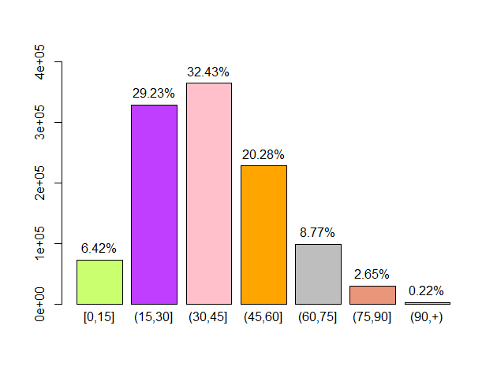
```
</center>

##
<center>
<h4>Análisis Descriptivo Bivariado</h4>
<h5>Contagiados por edad y sexo</h5>
</center>
<center>
```{r edad_contag, fig.align="center",out.width="600px"}
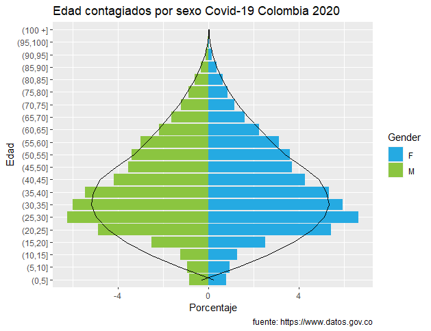
```
</center>


##
<center>
<h3> Confirmados diarios COVID-19</h3>
</center>
```{r descarga_datos2, echo=FALSE, message=FALSE}
df.ins31=read.csv("/Users/Natalia/Desktop/TESIS/2020-2/DOCUMENTOS FINAL TESIS/31dic.csv")
df.ins31$fecha_inicio_sintomas <- as.Date(df.ins31$fecha_inicio_sintomas,tryFormats = c("%d-%m-%Y", "%d/%m/%Y"))
df.ins31$fecha_de_notificaci_n <- as.Date(df.ins31$fecha_de_notificaci_n, tryFormats = c("%d-%m-%Y", "%d/%m/%Y"))
df.ins31$fecha_muerte <- as.Date(df.ins31$fecha_muerte, tryFormats = c("%d-%m-%Y", "%d/%m/%Y"))
df.ins31$fecha_recuperado <- as.Date(df.ins31$fecha_recuperado, tryFormats = c("%d-%m-%Y", "%d/%m/%Y"))
df.ins31$fecha_reporte_web <- as.Date(df.ins31$fecha_reporte_web, tryFormats = c("%d-%m-%Y", "%d/%m/%Y"))
df.ins31$fecha_diagnostico  <- as.Date(df.ins31$fecha_diagnostico, tryFormats = c("%d-%m-%Y", "%d/%m/%Y"))
df.ins31$confirmados <- "Confirmados" #Crea una columna para tener un conteo de los confirmados diarios.
df.ins31 <- df.ins31 %>%
  dplyr::select(id_de_caso,
                ciudad_municipio_nom,
                fecha_inicio_sintomas,
                confirmados,
                fecha_de_notificaci_n,
                fecha_diagnostico,
                fecha_muerte,
                fecha_reporte_web,
                everything()) #Reorganiza la base.
inc.casos.colombia.confirmados31 <- incidence(df.ins31$fecha_reporte_web,
groups = df.ins31$confirmados) #Hace un conteo de cantidad de 
#confirmados por fecha.
serie.colombia31 <- xts(x = inc.casos.colombia.confirmados31$counts,
                      order.by = inc.casos.colombia.confirmados31$dates)
ts_colombia31<- ts(serie.colombia31) #Convierte en una serie de tiempo tipo ts la serie anterior.

```

<center>
```{r}
plot(ts_colombia31,main="Curva de contagios en Colombia año 2020",xlab="Dias",ylim=c(0,16000))
```
</center>

##
<center>
```{r}
p <- dygraph(ts_colombia31) %>%
  dyOptions(labelsUTC = TRUE, fillGraph=TRUE, fillAlpha=0.1, drawGrid = FALSE, colors="#D8AE5A") %>%
  dyRangeSelector() %>%
  dyCrosshair(direction = "vertical") %>%
  dyHighlight(highlightCircleSize = 5, highlightSeriesBackgroundAlpha = 0.2, hideOnMouseOut = FALSE)  %>%
  dyRoller(rollPeriod = 1)
p
```
</center>


##
<center>
<h3>Fechas Importantes año 2020</h3>
</center>


1. **24 de Marzo**: Se decretó cuarentena en todo el territorio colombiano.
2. **6 de abril**: Se extendió por primera vez la cuarentena.
3. **5 de mayo**: Se extiende por segunda vez la cuarentena pero con reapertura gradual de algunos sectores productivos.
4. **19 de junio**: Se realizó el día sin IVA con la intención de reactivar la economía, sin embargo se presentaron una gran cantidad de aglomeraciones en toda Colombia.
5. **28 de julio**: Se extendió por tercera vez la cuarentena, pero en esta ocasión las poblaciones con menor cantidad de contagiados podían realizar la reapertura gradual de todas sus actividades económicas.


##
<center>
<h3>Fechas Importantes año 2020</h3>
</center>


6. **18 de agosto**: Se declara la semana del pico de la primera ola de la pandemia.
7. **30 de agosto**: Fin de la cuarentena obligatoria en Colombia.
8. **9 y 10 de septiembre**: En estas fechas se presentan una ola de protestas debido al fallecimiento de Javier Ordóñez a manos de la policia.
9. **1 de diciembre**: Inicio de la temporada navideña.
10. **27 de diciembre**: Partido de la final América de Cali vs Santa Fe.

##
<center>
<h3> Fechas Importantes año 2020</h3>
</center>

<center>
```{r fechas, message=FALSE}
plot(ts_colombia31,main="Curva de contagios en Colombia año 2020",xlab="Dias",ylim=c(0,16000))
abline(v=c(18,31,60,105,144,165,177,187,270,293),col=c("pink","red"
        ,"green","black","brown","darkgoldenrod","blue",
        "darkturquoise","deeppink","darkorchid4")) 
text(18,15500, "1", col = "black", adj = c(0, -.1))
text(31,15500, "2", col = "black", adj = c(0, -.1))
text(60,15500, "3", col = "black", adj = c(0, -.1))
text(105,15500, "4", col = "black", adj = c(0, -.1))
text(144,15500, "5", col = "black", adj = c(0, -.1))
text(165,15500, "6", col = "black", adj = c(0, -.1))
text(177,15500, "7", col = "black", adj = c(0, -.1))
text(187,15500, "8", col = "black", adj = c(0, -.1))
text(270,15500, "9", col = "black", adj = c(0, -.1))
text(293,15500, "10", col = "black", adj = c(0, -.1))
```
</center>


##
<center>
<h3>Generación de modelos</h3>
</center>
<div style="text-align: justify">
Tras analizar las variables suministradas por la base de datos del ministerio de salud procedemos a generar diferentes modelos aplicados a series de tiempo para luego compararlos y determinar el más eficiente para pronosticar al día 31 de diciembre de 2020 la cantidad de contagios diarios en Colombia.

La serie de tiempo seleccionada está dada por los casos de contagios confirmados diarios, se realizó un estudio de la estacionalidad y tendencia de la serie para saber si se podían aplicar los modelos. Finalmente, los modelos seleccionados fueron: **Holt-Winters**, **Holt**, **Medias Móviles** y **ARIMA**.

En las gráficas de los pronósticos la curva en rojo representa la estimación de los datos anteriores dada por cada modelo, en azul los pronósticos hasta el día 31 de diciembre de 2020 y en negro los datos reales. 

El pronóstico se realiza desde el día 22 de diciembre de 2020 hasta el día 31 de diciembre de 2020.
</div>

##
<center>
<h3>Modelo Holt-Winters</h3>
</center>

<div style="padding: 10px; float: left; width: 45%; text-align: justify;">
```{r hw_grafica, fig.align="center",out.width="600px"}
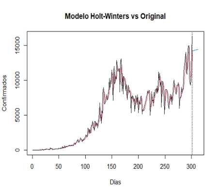
```
</div>
<div style="padding: 10px; float: right; width: 45%; text-align: justify;">
```{r hw_pronostico, fig.align="center",out.width="300px"}
include_graphics("pronHW.PNG")

```
</div>
```{r hw, echo=FALSE, message=FALSE}
modHW=HoltWinters(ts_colombia,seasonal="multiplicative",
                gamma=FALSE)
predmodHW=predict(modHW,n.ahead=10,prediction.interval = TRUE)
DAM_HW=  round(sum(abs(ts_colombia[-c(1:2),]-modHW$fitted[,1]))/length(ts_colombia[-c(1:2),]),2)
RMSE_HW = round(sqrt(sum((modHW$fitted[,1]-ts_colombia[-c(1:2),])^2)/length(ts_colombia[-c(1:2),])),2)
EMC_HW=round(((sum(ts_colombia[-c(1:2),] - modHW$fitted[,1]))^2)/length(ts_colombia[-c(1:2),]),2)
hw_pred=read.csv("/Users/Natalia/Desktop/TESIS/2020-2/DOCUMENTOS FINAL TESIS/hw_pred.csv") 
names(hw_pred)=("Contagiados")
hw_pred=ts(hw_pred)
```

##
<center>
<h4>Gráfico Modelo de Holt-Winters</h4>
```{r hw_dy, fig.align="center",out.width="700px"}
hw <- dygraph(hw_pred) %>%
  dyOptions(labelsUTC = TRUE, fillGraph=TRUE, fillAlpha=0.1, drawGrid = FALSE, colors="#D8AE5A") %>%
  dyRangeSelector() %>%
  dyCrosshair(direction = "vertical") %>%
  dyHighlight(highlightCircleSize = 5, highlightSeriesBackgroundAlpha = 0.2, hideOnMouseOut = FALSE)  %>%
  dyRoller(rollPeriod = 1)
hw
```
</center>

##
<center>
<h3>Modelo Holt</h3>
</center>

<div style="padding: 10px; float: left; width: 45%; text-align: justify;">
```{r holt_grafica, fig.align="center",out.width="600px"}
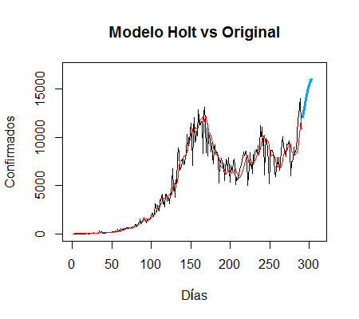
```
</div>
<div style="padding: 10px; float: right; width: 45%; text-align: justify;">
```{r holt_pronostico, fig.align="center",out.width="300px"}
include_graphics("pronHolt.PNG")
```
</div>


```{r holt, echo=FALSE, message=FALSE}
modhol=Holt(ts_colombia,plot=FALSE)
holt_prediccion=predict(modhol$estimate,level=0.8)
holt_prediccion=data.frame(holt_prediccion)
DAM_H=round(sum(abs(ts_colombia-modhol$estimate))/length(ts_colombia),2)
RMSE_H=round(sqrt(sum((modhol$estimate-ts_colombia)^2)/length(ts_colombia)),2)
EMC_H=round(((sum(ts_colombia - modhol$estimate))^2)/length(ts_colombia),2)
holt_pred=read.csv("/Users/Natalia/Desktop/TESIS/2020-2/DOCUMENTOS FINAL TESIS/modholt_es.csv") 
names(holt_pred)=("Contagiados")
holt_pred=ts(holt_pred)
```

##
<center>
<h4>Gráfica Modelo Holt</h4>
```{r holt_dy, fig.align="center",out.width="700px"}
holt_p <- dygraph(holt_pred) %>%
  dyOptions(labelsUTC = TRUE, fillGraph=TRUE, fillAlpha=0.1, drawGrid = FALSE, colors="#D8AE5A") %>%
  dyRangeSelector() %>%
  dyCrosshair(direction = "vertical") %>%
  dyHighlight(highlightCircleSize = 5, highlightSeriesBackgroundAlpha = 0.2, hideOnMouseOut = FALSE)  %>%
  dyRoller(rollPeriod = 1)
holt_p

```
</center>
##
<center>
<h3>Modelo de Medias Móviles</h3>
</center>
<div style="text-align: justify">
Para el caso de medias móviles analizamos el caso con 3, 7, 9 y 14 medias, para elegir el que mejor aproxima se tuvieron en cuenta los errores de **Desviación Absoluta de la Media (DAM)**, **Error Cuadrático Medio (EMC)** y **Raíz del Error Cuadrático Medio (RMSE)**.
</div>

```{r medias, echo=FALSE, message=FALSE}
media3=ma(ts_colombia,3)
mediamov3=na.omit(media3)
pred=predict(mediamov3,level=0.8)
DAM_MA3=  round(sum(abs(ts_colombia-mediamov3))/length(ts_colombia),2)
RMSE_MA3 = round(sqrt(sum((mediamov3-ts_colombia)^2)/length(ts_colombia)),2)
EMC_MA3=round(((sum(ts_colombia - mediamov3))^2)/length(ts_colombia),2)
pred1=read.csv("/Users/Natalia/Desktop/TESIS/2020-2/DOCUMENTOS FINAL TESIS/predmma.csv") 
names(pred1)=("Contagiados")
pred1=ts(pred1)
#####################Medias moviles 7#########################################
media7=ma(ts_colombia,7)
mediamov7=na.omit(media7)
pred=predict(mediamov7,level=0.80)
DAM_MA7=  round(sum(abs(ts_colombia-mediamov7))/length(ts_colombia),2)
RMSE_MA7 = round(sqrt(sum((mediamov7-ts_colombia)^2)/length(ts_colombia)),2)
EMC_MA7=round(((sum(ts_colombia - mediamov7))^2)/length(ts_colombia),2)
#####################Medias moviles 9#########################################
media9=ma(ts_colombia,9)
mediamov9=na.omit(media9)
pred=predict(mediamov9,level=0.80)
DAM_MA9=  round(sum(abs(ts_colombia-mediamov9))/length(ts_colombia),2)
RMSE_MA9 = round(sqrt(sum((mediamov9-ts_colombia)^2)/length(ts_colombia)),2)
EMC_MA9=round(((sum(ts_colombia - mediamov9))^2)/length(ts_colombia),2)
#####################Medias moviles 14#########################################
media14=ma(ts_colombia,14)
mediamov14=na.omit(media14)
pred=predict(mediamov14,level=0.80)
DAM_MA14=  round(sum(abs(ts_colombia-mediamov14))/length(ts_colombia),2)
RMSE_MA14 = round(sqrt(sum((mediamov14-ts_colombia)^2)/length(ts_colombia)),2)
EMC_MA14=round(((sum(ts_colombia - mediamov14))^2)/length(ts_colombia),2)
MEDIAMOV=c("3","7","9","14")
DAMMA=c(DAM_MA3,DAM_MA7,DAM_MA9,DAM_MA14)
RMSEMA=c(RMSE_MA3,RMSE_MA7,RMSE_MA9,RMSE_MA14)
EMCMA=c(EMC_MA3,EMC_MA7,EMC_MA9,EMC_MA14)
```

<center>
<h3>Selección del mejor modelo de medias móviles</h3>
</center>

```{r medias_seleccion}
data.frame(cbind(MEDIAMOV,DAMMA,RMSEMA,EMCMA))
```

##
<center>
<h3>Modelo de Medias Móviles</h3>
</center>

<div style="padding: 10px; float: left; width: 45%; text-align: justify;">
```{r mm_grafica, fig.align="center",out.width="600px"}
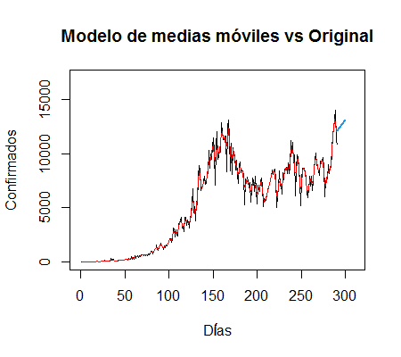
```
</div>
<div style="padding: 10px; float: right; width: 45%; text-align: justify;">
```{r mm_pronostico, fig.align="center",out.width="300px"}
include_graphics("pronmm.PNG")
```
</div>

##
<center
<h4>Gráfica Modelo de Medias Móviles</h4>
```{r mm_dy, fig.align="center",out.width="700px"}

mm <- dygraph(pred1) %>%
  dyOptions(labelsUTC = TRUE, fillGraph=TRUE, fillAlpha=0.1, drawGrid = FALSE, colors="#D8AE5A") %>%
  dyRangeSelector() %>%
  dyCrosshair(direction = "vertical") %>%
  dyHighlight(highlightCircleSize = 5, highlightSeriesBackgroundAlpha = 0.2, hideOnMouseOut = FALSE)  %>%
  dyRoller(rollPeriod = 1)
mm

```
</center>

##
<center>
<h3>Modelo ARIMA</h3>
</center>
<div style="text-align: justify">
Para el modelo ARIMA se analizó si la serie de tiempo presentaba tendencia, en este caso mediante el comando ndiffs del paquete forecast podemos concluir que si existía, para poder eliminarla se realizó una diferencia la cual consta de restar cada par de datos consecutivos para crear una nueva serie.

Para conocer el grado del modelo Autorregresivo (AR) y el modelo de Medias Móviles se analizan las gráficas de autocorrelación y autocorrelación parcial.
</div>


<center>
<h3> Función de autocorrelación y autocorrelación parcial</h3>

```{r acf_arima, fig.align="center",out.width="750px"}
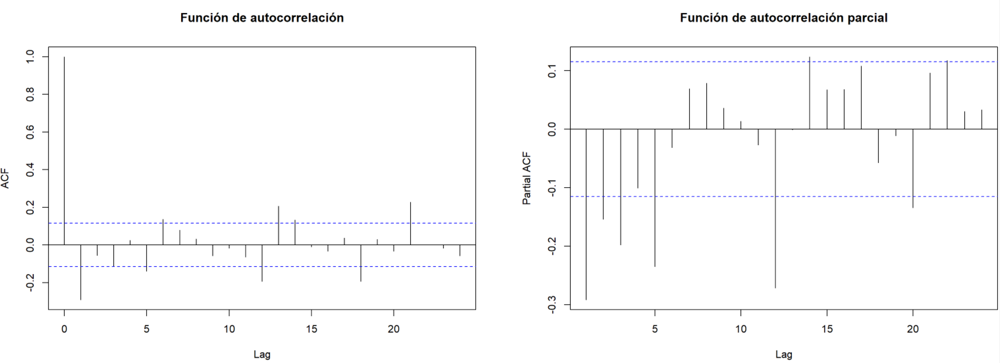

```
</center>


##
<center>
<h3>Modelo ARIMA</h3>
</center>
<div style="padding: 10px; float: left; width: 45%; text-align: justify;">
```{r arima_graf, fig.align="center",out.width="600px"}
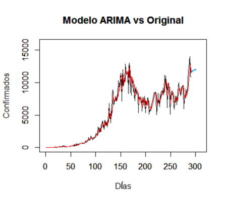
```
</div>
<div style="padding: 10px; float: right; width: 45%; text-align: justify;">
```{r arima_pronostico, fig.align="center",out.width="300px"}
include_graphics("pronarima.PNG")
```
</div>

<center>

```{r arima, message=FALSE}
arima=Arima(ts_colombia,order = c(1,1,3),seasonal = list(order=c(1,1,1),period=1))
forecast1=forecast(arima,level=95)
DAM_ARI=  round(sum(abs(ts_colombia-forecast1$fitted))/length(ts_colombia),2)
RMSE_ARI = round(sqrt(sum((forecast1$fitted-ts_colombia)^2)/length(ts_colombia)),2)
EMC_ARI=round(((sum(ts_colombia - forecast1$fitted))^2)/length(ts_colombia),2)
arima_pred=read.csv("/Users/Natalia/Desktop/TESIS/2020-2/DOCUMENTOS FINAL TESIS/arima_est.csv") 
names(arima_pred)=("Contagiados")
arima_pred=ts(arima_pred)
```
</center>

##
<center>
<h4>Gráfica de Modelo ARIMA</h4>
```{r arima_dy, fig.align="center",out.width="700px"}
arima_predi <- dygraph(arima_pred) %>%
  dyOptions(labelsUTC = TRUE, fillGraph=TRUE, fillAlpha=0.1, drawGrid = FALSE, colors="#D8AE5A") %>%
  dyRangeSelector() %>%
  dyCrosshair(direction = "vertical") %>%
  dyHighlight(highlightCircleSize = 5, highlightSeriesBackgroundAlpha = 0.2, hideOnMouseOut = FALSE)  %>%
  dyRoller(rollPeriod = 1)
arima_predi
```
</center>

##
<center>
<h3>Modelo ARIMA mediante la función *auto.arima*</h3>
</center>
<div style="text-align: justify">
En R existe la función *auto.arima* para simplificar la estimación del modelo. Mediante esta función obtenemos los siguientes resultados:
</div>

```{r auto.arima, message=FALSE}
ajuste_autoarima=auto.arima(y=serie.colombia)

summary(ajuste_autoarima)
##  predicciones
predicciones=forecast(ajuste_autoarima, h=15)
```


##

<center>
<h3> Comparación de modelos</h3>
</center>
<div style="text-align: justify">
Para escoger el mejor modelo analizamos los errores **DAM**, **RMSE** y **EMC**.
</div>


```{r comparacion, message=FALSE}
MODELO=c("Holt","Holt Winters","Media Movil","ARIMA")
DAM=c(DAM_H,DAM_HW,DAM_MA3,DAM_ARI)
RMSE=c(RMSE_H,RMSE_HW,RMSE_MA3,RMSE_ARI)
EMC=c(EMC_H,EMC_HW,EMC_MA3,EMC_ARI)
data.frame(cbind(MODELO,DAM,RMSE,EMC))
```


</center>

##
<center>
<h3>Pronósticos vs Datos Reales</h3>

```{r todos_pronostico, fig.align="center",out.width="600px"}
include_graphics("todos.PNG")
```
</center>

##

<center>
<h3>Pronósticos vs Datos Reales</h3>
```{r comp_pron, fig.align="center",out.width="900px"}
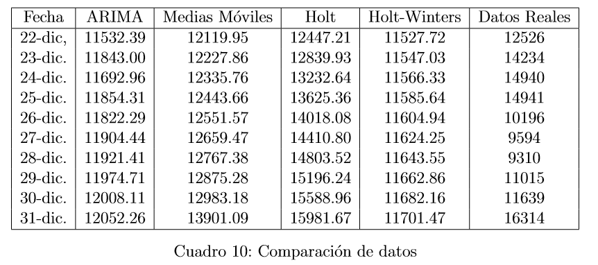
```
</center>

##
<center>
<h3>Comparación con Modelo de SALUTIA</h3>
</center>

<center>
```{r salutia, fig.align="center",out.width="600px"}
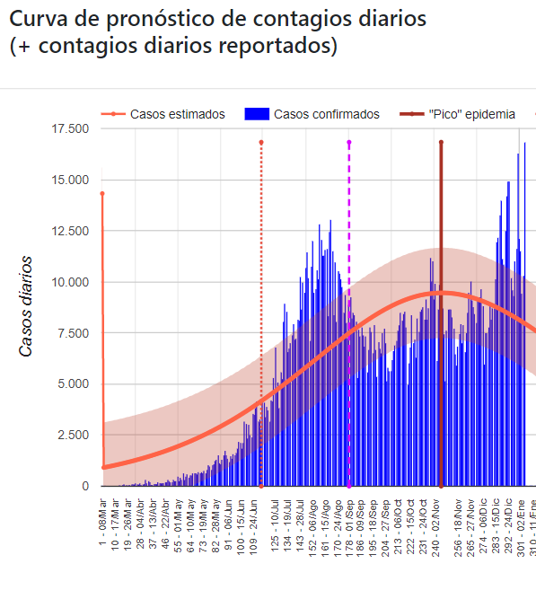
```
</center>


##
<center>
<h3>Dashboard</h3>
</center>

```{r dash, fig.align="center",out.width="450px"}
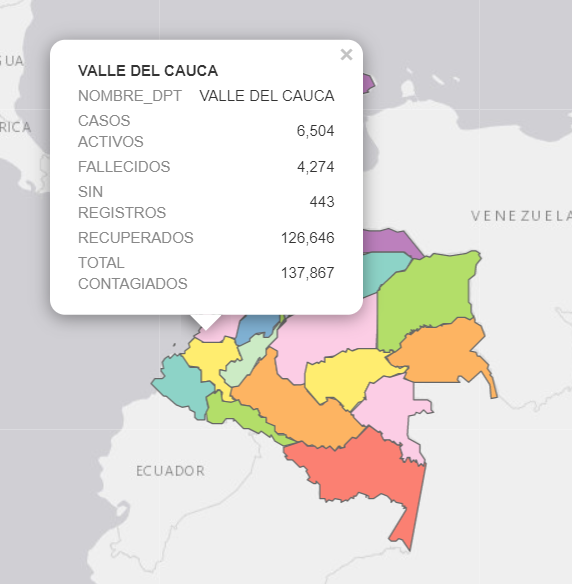
```

https://nativanegas.github.io/index.html

##
<center>
<h3>Conclusiones y recomendaciones</h3>
</center>
<div style="text-align: justify">
* Se realizó un estudio previo acerca de modelos de predicción estadístico y matemáticos para pronosticar la cantidad de contagiados diarios de COVID-19 en Colombia al día 31 de diciembre de 2020.
* Los modelos seleccionados fueron **Holt-Winters**, **Holt**, **Medias Móviles** y **ARIMA**, se realizaron pronósticos utilizando el lenguaje estadístico R y posteriormente utilizando los errores: **Desviación Absoluta de la Media**, **Error Medio Cuadrático** y **Raíz del Error Cuadrático Medio** vemos que el mejor modelo es el de Medias Móviles.
* Se plantea un dashboard dinámico que muestre la cantidad de contagiados, muertos y recuperados por departamento para mostrar de una manera gráfica la repercusión del COVID-19 en nuestro país.
* Se deja abierta la oportunidad de trabajar con diversos métodos estadísticos-matemáticos aplicados a series de tiempo para conocer el impacto de la vacuna en Colombia que comenzará a suministrarse en el año 2021.
</div>


